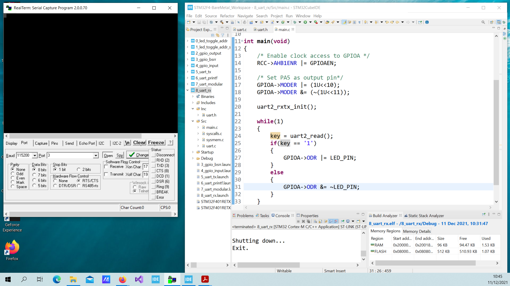

# Embedded Systems Bare-Metal Programming Ground Up™ (STM32): Program 8

[Code Development follows this Udemy Course](https://www.udemy.com/course/embedded-systems-bare-metal-programming/)

## Specs

Host

* MS Windows 10.0.19042
* STM32CubeIDE 1.8.0
* RealTerm 2.0.0.70

Device

* STM32F401RE chip
* STM32 Nucleo-64 development board

## Topic

This program combines two main areas of focus:

* Toggling the LED
* UART2 communication

RealTerm program running on host sends characters to the board.

Program 8 running on the device does the following:

* Reads one character at a time from the UART2 RX pin
* If the character is '1' the LED is turned on, otherwise it is turned off

## Output

Screenshot of Host

Video of Test

